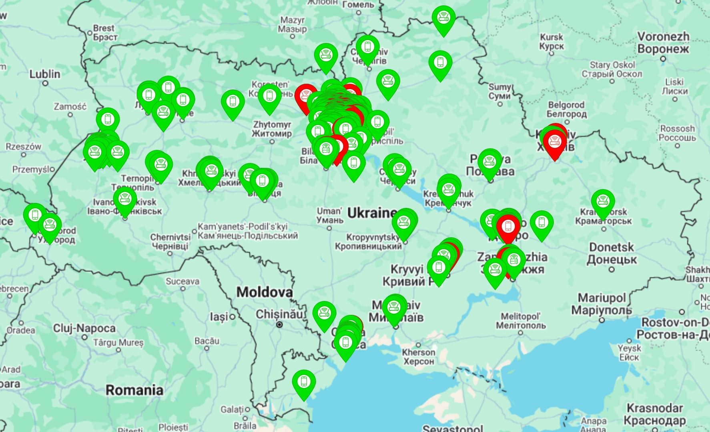

# SvitloBot: Telegram ChatBot for Power Outage Alerts ⚡📲

SvitloBot is a community-driven project developed to help Ukrainians navigate the frequent electricity shortages caused by relentless Russian bombings. By providing real-time notifications about the power status in homes, SvitloBot ensures users stay informed and connected during challenging times.

---

## 🌟 Highlights
- **🌐 Community-Driven**: Over **138,923 active users** across Ukraine with **1,167 houses connected**.
- **🚨 Real-Time Notifications**: Know instantly if the power in your home is on or off.
- **📊 Detailed Statistics**: View daily and weekly reports on power outages and availability.
- **🤖 Easy Integration**: Create your personalized Telegram channel with simple setup instructions.
- **📅 Plan Better**: Receive outage forecasts and updates with data precision up to 5 minutes.
- **💡 User-Friendly**: Accessible via any platform – Android, iOS, or desktop – and works seamlessly with old smartphones.

---
## Real-Time Map of 1000+ households across Ukraine

---

## 🚀 How It Works

1. **Wi-Fi Monitoring**: SvitloBot pings your Wi-Fi router (or any other network device) to detect connectivity.
2. **Device Integration**: Connect a smartphone, tablet, or another device to send periodic signals based on power availability.
3. **Telegram Notifications**: If power goes out or comes back, SvitloBot instantly notifies you via Telegram.
4. **Detailed Insights**: Track outage durations, next expected power availability, and past statistics through the bot interface.

---

## 🛠️ Setup Instructions

1. **Download SvitloBot App**: Install it on an old smartphone, tablet, or device connected to a charging socket.
2. **Link to Telegram**:
   - Visit the SvitloBot website for a step-by-step guide.
   - Configure the bot to monitor your specific location and connect it to your Telegram account.
3. **Customize Alerts**:
   - Set alert preferences (e.g., notification frequency, delay thresholds).
   - Enable data sharing to track power trends.

Visit **[SvitloBot Setup Guide](https://svitlobot.in.ua)** for detailed instructions.

---

## 📈 Achievements
- **138,923 Active Users**: Trusted by a growing community during critical times.
- **1,167 Houses Connected**: Monitoring power status across Ukrainian households.
- **393,565,699 Requests Processed**: Efficiently handling real-time data requests.

---

## 🎤 What Users Say

> *"Incredibly fast and convenient. I’ve been using SvitloBot for months, and it’s the easiest way to stay informed about power availability at home and work."*  
> — **Davydenko Cheslav**

> *"I thought setting this up would be complicated, but it took only 15 minutes with an old smartphone. It works perfectly!"*  
> — **Markevich Gennady**

> *"SvitloBot is a lifesaver for tracking outages and planning my day. Highly recommended!"*  
> — **Ivashchuk Irynar**

---

## 📺 Ukrainian Video News

Watch how SvitloBot is helping the Ukrainian community:  
**[Watch the Video](https://www.youtube.com/watch?v=MlPzJVBhyzU)**  

---

## 💬 Community and Support

- **Telegram Support**: [@SvitloBotAdmin](https://t.me/SvitloBotAdmin)
- **Community Updates**: [@svitlobot_news](https://t.me/svitlobot_news)
- **Website**: [SvitloBot Official](https://svitlobot.in.ua)

---

## 💡 Why SvitloBot?

SvitloBot empowers Ukrainians by providing accurate, real-time power outage updates. It’s free, reliable, and easy to use, making it an essential tool in uncertain times. Join the thousands already benefiting from SvitloBot today!

---
### Developed by:  
Dmytro Chygarov and Artem Chygarov – Kyiv school students striving to make life easier for their community.
